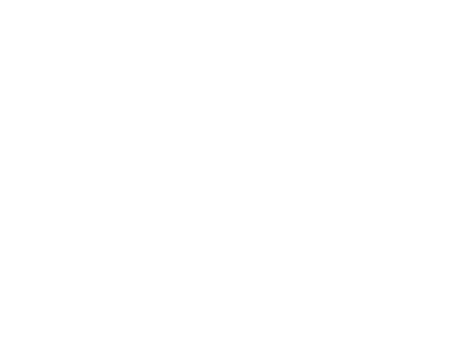

# Renovision

**AI-powered property renovation visualisation for Rightmove listings.**

Paste a Rightmove URL, select a room, configure your renovation style, and watch AI transform it into your dream space. Built for those who see past the magnolia.



---

## ✨ Features

- 🏠 **Rightmove Integration** — Automatically scrapes property images using Playwright
- 🎨 **6 Design Styles** — Mid-Century, Minimal, Industrial, Scandinavian, Wabi-Sabi, Mediterranean
- 🌅 **Time of Day Lighting** — Day, Night, or Golden Hour
- 🎨 **10 Colour Schemes** — From Soft Linen to Midnight Blue
- 🪵 **5 Flooring Types** — Wood Parquet, Tiled, Stone, Concrete, Carpetted
- 🌿 **Smart Room Detection** — AI identifies room types from captions
- 🖼️ **Interactive Before/After Slider** — Touch-friendly comparison
- 📱 **Mobile Optimized** — No-zoom viewport, smooth touch interactions
- 🎭 **Witty Placeholder Text** — 60+ playful suggestions with typewriter animation

---

## 🚀 Quick Start

### Prerequisites

- Python 3.11+
- Playwright (for Chromium browser automation)
- API key from Google AI Studio or Replicate

### Backend Setup

```bash
# Install dependencies
pip install -r requirements.txt

# Install Playwright browsers (REQUIRED)
playwright install chromium

# Configure environment variables
cp .env.example .env
# Add your GEMINI_API_KEY or REPLICATE_API_TOKEN

# Run the server
uvicorn main:app --reload --port 8000
```

### Frontend

The frontend is a self-contained single HTML file with embedded React:

```bash
# Development: Open directly
open index.html

# Or serve with HTTP server
python -m http.server 3000
```

Visit `http://localhost:3000`

---

## 🏗️ Architecture

```
┌─────────────────────┐
│                     │
│   Single-File       │
│   React App         │
│   (index.html)      │
│                     │
└──────────┬──────────┘
           │
           ▼
┌─────────────────────┐      ┌─────────────────────┐
│                     │      │                     │
│   FastAPI           │─────▶│   Gemini 2.0 Flash  │
│   Backend           │      │   or Replicate      │
│   (main.py)         │      │   Nano Banana       │
│                     │      │                     │
└──────────┬──────────┘      └─────────────────────┘
           │
           ▼
┌─────────────────────┐
│                     │
│   Playwright        │
│   Scraper           │
│   (rightmove_       │
│    scraper.py)      │
│                     │
└──────────┬──────────┘
           │
           ▼
┌─────────────────────┐
│                     │
│   Rightmove         │
│   Property          │
│   Listings          │
│                     │
└─────────────────────┘
```

---

## 🎨 Configuration Options

### Design Styles

| Style | Description |
|-------|-------------|
| **Mid-Century** | Warm walnut tones, organic curves, iconic hairpin legs |
| **Minimal** | Clutter-free styling, refined neutrals, hidden storage |
| **Industrial** | Metal fixtures, concrete surfaces, urban warehouse character |
| **Scandinavian** | Hygge-inspired, light oak, cosy textiles, bright whites |
| **Wabi-Sabi** | Natural imperfection, low furniture, zen minimalism |
| **Mediterranean** | Terracotta tones, wrought iron, sun-bleached colours |

### Room Types

Living, Bedroom, Kitchen, Dining, Bathroom, Office, Hallway, Garden, Outdoor

### Time of Day

- **Day** — Bright daylight, soft natural light, minimal shadows
- **Night** — Dark exterior, warm ambient lighting, moody atmosphere
- **Golden Hour** — Strong warm sunlight, high contrast, cinematic glow

### Colour Schemes

Soft Linen • Cream Core • Sage Calm • Terracotta Sun • Olive Grove • Burgundy Depth • Forest Green • Midnight Blue • Amber Glow • Nordic Mist

### Flooring

Wood Parquet • Tiled • Stone Slabs • Polished Concrete • Carpetted

---

## 🔧 API Endpoints

### `POST /property`
Extract property images from Rightmove listing.

**Request:**
```json
{
  "url": "https://www.rightmove.co.uk/properties/87288435"
}
```

**Response:**
```json
{
  "url": "...",
  "property_id": "87288435",
  "address": "Example Street, London",
  "price": "£500,000",
  "bedrooms": 3,
  "bathrooms": 2,
  "images": [
    {
      "id": 0,
      "url": "...",
      "url_high_res": "...",
      "room": "living",
      "caption": "Living Room"
    }
  ]
}
```

### `POST /renovate`
Generate renovated version of a room.

**Request:**
```json
{
  "image_url": "https://...",
  "style": "midcentury",
  "room_type": "living",
  "time_of_day": "golden_hour",
  "colour_scheme": "sage_calm",
  "flooring": "wood_parquet",
  "extra_notes": "Velvet emerald sofa, brass fixtures"
}
```

**Response:**
```json
{
  "original_url": "...",
  "generated_image_base64": "...",
  "room_type": "living",
  "style": "midcentury"
}
```

### `GET /proxy-image?url=...`
Proxy Rightmove images as base64 (bypasses CORS).

### `GET /health`
Health check endpoint.

---

## 🌐 Deployment

Configured for Render.com via `render.yaml`:

```yaml
services:
  - type: web
    name: renovision
    runtime: python
    buildCommand: |
      pip install --upgrade pip setuptools wheel
      pip install -r requirements.txt
      playwright install --with-deps chromium
    startCommand: uvicorn main:app --host 0.0.0.0 --port $PORT
```

**Environment Variables:**
- `GEMINI_API_KEY` or `REPLICATE_API_TOKEN`
- `IMAGE_PROVIDER` (optional: "gemini" or "replicate")
- `PLAYWRIGHT_BROWSERS_PATH=/opt/render/project/.cache/ms-playwright`

**Important:** The Playwright installation with `--with-deps` flag is critical for production deployment.

---

## 🛠️ Tech Stack

**Frontend:**
- React 18 (via CDN, no build step)
- Tailwind CSS (JIT via CDN)
- Babel Standalone (JSX transpilation)
- Cormorant Garamond + Inter fonts

**Backend:**
- Python 3.11+
- FastAPI
- Playwright (headless Chromium)
- Pillow (image processing)
- httpx (async HTTP)

**AI:**
- Gemini 2.0 Flash (Google)
- Replicate Nano Banana (alternative)

---

## 📱 Mobile Features

- **No-Zoom Viewport** — Locked at 100% scale for perfect fit
- **Touch-Optimized Slider** — Prevents page scroll during interaction
- **Body Scroll Lock** — Smooth slider dragging without page movement
- **Responsive Grid** — Adapts from 2 to 4 columns based on screen size

---

## ⚡ Key Implementation Details

### Rightmove Scraping
Uses Playwright with headless Chromium to render JavaScript-heavy pages. Extracts `window.PAGE_MODEL` using brace-counting algorithm (not regex) to handle 500KB+ JSON objects.

### Image Generation Prompts
Focuses on **editing** (not generating) images. Emphasizes keeping exact room dimensions, window/door positions, and camera angle. Special handling for outdoor spaces.

### Room Type Detection
Two-stage detection:
1. Caption matching against keyword dictionary
2. Positional heuristics for filename-only captions

### Kitchen Intelligence
Only adds island if space permits, tries peninsula as fallback, keeps as galley if constrained. No automatic dining tables.

---

## 🎭 Easter Eggs

The Extra Notes textarea features 60 witty placeholder suggestions with typewriter animation:

- "Pop a Keith Haring on that wall, your sofa will thank you..."
- "A gilt-framed portrait of a cat judging your life choices..."
- "A velvet chaise for napping while pondering the futility of existence..."
- "A chandelier so flamboyant it demands applause from the furniture..."

---

## 🚨 Known Limitations

- **Rightmove Blocking** — May rate-limit aggressive scraping
- **Gemini Geo-Blocking** — Image generation blocked in UK/EU (use Replicate)
- **Generation Time** — ~15-30 seconds per image
- **Browser Automation** — Requires Playwright + Chromium (~300MB)
- **Image Size Limits** — Auto-resizes to 2048px for Gemini compatibility

---

## 🔮 Future Enhancements

- [ ] Save renovation boards
- [ ] Multiple style comparisons
- [ ] Cost estimation
- [ ] Shareable links
- [ ] User accounts
- [ ] Zoopla/OnTheMarket integration
- [ ] Batch processing
- [ ] PDF export

---

## 📄 License

MIT — Built by Wallcache Studios.

---

**For Those Who See Past The Photos.**
